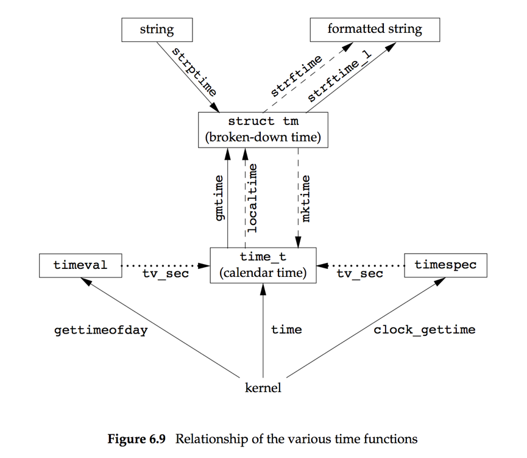

系统数据文件和信息
---

口令文件
---

/etc/passwd

Fields in /etc/passwd file

Description | struct passwd member | POSIX.1 | FreeBSD 8.0 | Linux 3.2.0 | Mac OS X 10.6.8 | Solaris 10
---|---|---|---|---|---|---
user name | char  *pw_name | • | • | • | • | •
encrypted password | char  *pw_passwd | | • | •  | • | •
numerical user ID | uid_t  pw_uid | • | • | •  | • | •
numerical group ID | gid_t  pw_gid | • | • | • | • | •
comment field | char  *pw_gecos | | • | • | • | •
initial working directory | char  *pw_dir | • | • | • | • | •
initial shell (user program) | char  *pw_shell | • | • | • | • | •
user access class | char  *pw_class | | • | | • | •
next time to change password | time_t pw_change | | • | | • | •
account expiration time | time_t pw_expire | | • | | • | •

For example, contents of /etc/passwd file on Linux:
>root:x:0:0:root:/root:/bin/bash<br>
>squid:x:23:23::/var/spool/squid:/dev/null<br>
>nobody:x:65534:65534:Nobody:/home:/bin/sh<br>
>sar:x:205:105:Stephen Rago:/home/sar:/bin/bash

* There is usually an entry with the user name root. This entry has a user ID of 0 (the superuser).
* The encrypted password field contains a single character as a placeholder;
* If the encrypted password field is empty, it usually means that the user does not have a password.
* The shell field contains the name of the executable program to be used as the login shell for the user.
* shell 字段为 /dev/null，/bin/false, /bin/true 时均可阻止用户登录。
* The nobody user name can be used to allow people to log in to a system, but with a user ID (65534) and group ID (65534) that provide no privileges.

```c
#include <pwd.h>
struct passwd *getpwuid(uid_t uid);
struct passwd *getpwnam(const char *name);
		//	Both return: pointer if OK, NULL on error
```

getpwuid 被`ls(1)`命令使用，它将i节点中的用户ID转换为用户登录名，getpwnam 被`login(1)`程序使用。
这两个函数的返回为函数内部静态变量，再次调用重写其中内容。

```c
#include <pwd.h>
struct passwd *getpwent(void);
		//	Returns: pointer if OK, NULL on error or end of file
void setpwent(void);
void endpwent(void);
```

这组函数用于遍历整个口令文件。setpwent 用于定位到文件的开始，getpwent用于逐条读取记录，返回NULL表示出错或到文件结尾。endpwent用于关闭口令文件。

阴影口令
---

/etc/shadow

口令文件由于访问权限比较开放，其早起的系统对口令的散列算法比较简单，导致口令散列值泄露后很容易被反猜出口令明文。所以后来的系统将加密口令存储在阴影口令文件(shadow file)中,且严格限制了该文件的访问权限。

Fields in /etc/shadow file

Description | struct spwd member
--- | ---
user login name | char *sp_namp
encrypted password | char *sp_pwdp
days since Epoch of last password change | int   sp_lstchg
days until change allowed | int   sp_min
days before change required | int   sp_max
days warning for expiration | int   sp_warn
days before account inactive | int   sp_inact
days since Epoch when account expires | int   sp_expire
reserved | unsigned int sp_flag

可访问阴影口令文件的函数
```c
#include <shadow.h>
struct spwd *getspnam(const char *name); 
struct spwd *getspent(void);
		//	Both return: pointer if OK, NULL on error
void setspent(void);
void endspent(void);
```
这组函数与访问passwd文件的那组类似。

组文件
---

/etc/group

Fields in /etc/group file

Description | struct group member
--- | ---
group name | char  *gr_name
encrypted password | char  *gr_passwd
numerical group ID | int    gr_gid
array of pointers to individual user names | `char **gr_mem`

gr_mem是一个指针数组，每个指针指向一个属于该数组的用户名

```c
#include <grp.h>
struct group *getgrgid(gid_t gid);
struct group *getgrnam(const char *name);
		//	Both return: pointer if OK, NULL on error
```

```c
#include <grp.h>
struct group *getgrent(void);
		//	Returns: pointer if OK, NULL on error or end of file
void setgrent(void);
void endgrent(void);
```
这组函数与上面类似，用于遍历group文件。

附加组ID
---

在UNIX Version 7 中，用户任何时候只属于一个组。登录时，按口令文件中记录的组ID赋给用户实际组ID；任何时候执行`newgrp`(1)可以更改用户的组ID，执行不带参数的newgrp可以返回到原来的组。

在4.2BSD中引入了附加组的ID，用户可以同时属于多达16 个组。

```c
#include <unistd.h>
int getgroups(int gidsetsize, gid_t grouplist[]);
		//	Returns: number of supplementary group IDs if OK, −1 on error 

#include <grp.h> /* on Linux */
#include <unistd.h> /* on FreeBSD, Mac OS X, and Solaris */ 
int setgroups(int ngroups, const gid_t grouplist[]);

#include <grp.h>    /* on Linux and Solaris */
#include <unistd.h> /* on FreeBSD and Mac OS X */
int initgroups(const char *username, gid_t basegid);
		//	Both return: 0 if OK, −1 on error
```

getgroups的参数grouplist是传出参数，用于返回附加组ID，传入参数gidsetsize为0时，返回附加组ID数；通常连续调用两次，第一次确认附加组ID个数，同时生成适当大小的grouplist，第二次掉用户返回所有的附加组ID。

setgroups由超级用户调用以便为调用进程设置附加组ID。

实现区别
---

Information | FreeBSD 8.0 | Linux 3.2.0 | Mac OS X 10.6.8 | Solaris 10
--- | --- | --- | --- | ---
account information | /etc/passwd | /etc/passwd | Directory Services | /etc/passwd 
encrypted passwords | /etc/master.passwd | /etc/shadow | Directory Services | /etc/shadow 
hashed password files? | yes | no | no | no 
group information | /etc/group | /etc/group | Directory Services | /etc/group

其他数据文件
---

/etc/services	记录各网络服务器提供的服务
/etc/protocols	记录协议信息
/etc/networks	记录网络信息
/etc/hosts		hosts

这些文件均有一组与passwd类似的get*，set*，end* 函数

Similar routines for accessing system data files

Description | Data file | Header | Structure | Additional keyed lookup functions
--- | --- | --- | --- | ---
passwords | /etc/passwd | <pwd.h> | passwd | getpwnam, getpwuid 
groups | /etc/group | <grp.h> | group | getgrnam, getgrgid 
shadow | /etc/shadow | <shadow.h> | spwd | getspnam
hosts | /etc/hosts | <netdb.h> | hostent | getnameinfo, getaddrinfo 
networks | /etc/networks | <netdb.h> | netent | getnetbyname, getnetbyaddr 
protocols | /etc/protocols | <netdb.h> | protoent | getprotobyname, getprotobynumber 
services | /etc/services | <netdb.h> | servent | getservbyname, getservbyport

登录账户记录
---
utmp文件，记录当前登录进系统的各个用户。
wtmp文件，跟踪各个登录和注销事件。

`who`命令读取utmp文件，并以可读格式打印其内容。
`last`命令读取wtmp文件

系统标识
---

```c
#include <sys/utsname.h>
int uname(struct utsname *name);
		//	Returns: non-negative value if OK, −1 on error
```

uname 返回当前主机与操作系统相关的信息。

```c
struct utsname {
	char  sysname[];	/* name of the operating system */
	char  nodename[];	/* name of this node */
	char  release[];	/* current release of operating system */
	char  version[];	/* current version of this release */
	char  machine[];	/* name of hardware type */
};
```

```c
#include <unistd.h>
int gethostname(char *name, int namelen);
		//	Returns: 0 if OK, −1 on error
```

日期和时间
---

```c
#include <time.h>
time_t time(time_t *calptr);
		//	Returns: value of time if OK, −1 on error
```

```c
#include <sys/time.h>
int clock_gettime(clockid_t clock_id, struct timespec *tsp);
		//	Returns: 0 if OK, −1 on error
```

Clock type identifiers

Identifier | Option | Description
--- | --- | ---
CLOCK_REALTIME | | real system time
CLOCK_MONOTONIC | `_POSIX_MONOTONIC_CLOCK` | real system time with no negative jumps 
CLOCK_PROCESS_CPUTIME_ID | `_POSIX_CPUTIME` | CPU time for calling process
CLOCK_THREAD_CPUTIME_ID | `_POSIX_THREAD_CPUTIME` | CPU time for calling thread

The clock_gettime function can be used to get the time of the specified clock.

```c
#include <sys/time.h>
int clock_getres(clockid_t clock_id, struct timespec *tsp);
		//	Returns: 0 if OK, −1 on error
```
We can use the clock_getres function to determine the resolution of a given system clock.

```c
#include <sys/time.h>
int clock_settime(clockid_t clock_id, const struct timespec *tsp);
		//	Returns: 0 if OK, −1 on error
```
To set the time for a particular clock, we can call the clock_settime function.


```c
#include <sys/time.h>
int gettimeofday(struct timeval *restrict tp, void *restrict tzp);
Returns: 0 always
```
gettimeofday provides greater resolution (up to a microsecond) than the time function.

```c
struct tm {      /* a broken-down time */
     int  tm_sec;   /* seconds after the minute: [0 - 60] */
     int  tm_min;   /* minutes after the hour: [0 - 59] */
     int  tm_hour;  /* hours after midnight: [0 - 23] */
     int  tm_mday;  /* day of the month: [1 - 31] */
     int  tm_mon;   /* months since January: [0 - 11] */
     int  tm_year;  /* years since 1900 */
     int  tm_wday;  /* days since Sunday: [0 - 6] */
     int  tm_yday;  /* days since January 1: [0 - 365] */
     int  tm_isdst; /* daylight saving time flag: <0, 0, >0 */
};
```


```c
#include <time.h>
struct tm *gmtime(const time_t *calptr); 
struct tm *localtime(const time_t *calptr);
		//	Both return: pointer to broken-down time, NULL on error
```
The difference between localtime and gmtime is that the first converts the calendar time to the local time, taking into account the local time zone and daylight saving time flag, whereas the latter converts the calendar time into a broken-down time expressed as UTC.


```c
#include <time.h>
time_t mktime(struct tm *tmptr);
		//	Returns: calendar time if OK, −1 on error
```
The function mktime takes a broken-down time, expressed as a local time, and converts it into a time_t value.

```c
#include <time.h>
size_t strftime(char *restrict buf, size_t maxsize, 
			const char *restrict format,
			const struct tm *restrict tmptr);
size_t strftime_l(char *restrict buf, size_t maxsize, 
			const char *restrict format,
			const struct tm *restrict tmptr, locale_t locale); 
		//	Both return: number of characters stored in array if room, 0 otherwise
```
The strftime function is a printf-like function fortime values.<br>
The strftime and strftime_l functions are the same, except that the strftime_l function allows the caller to specify the locale as an argument. The strftime function uses the locale specified by the TZ environment variable.

```c
#include <time.h>
char *strptime(const char *restrict buf, const char *restrict format,
struct tm *restrict tmptr);
		//	Returns: pointer to one character past last character parsed, NULL otherwise
```

The strptime function is the inverse of strftime. It takes a string and converts it into a broken-down time.


