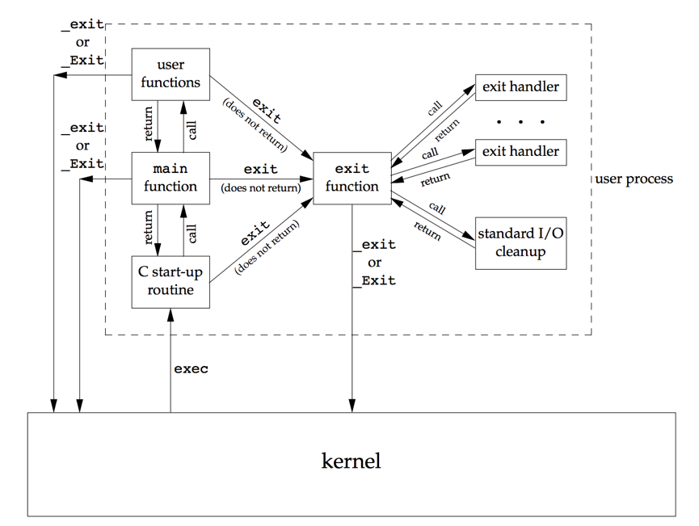
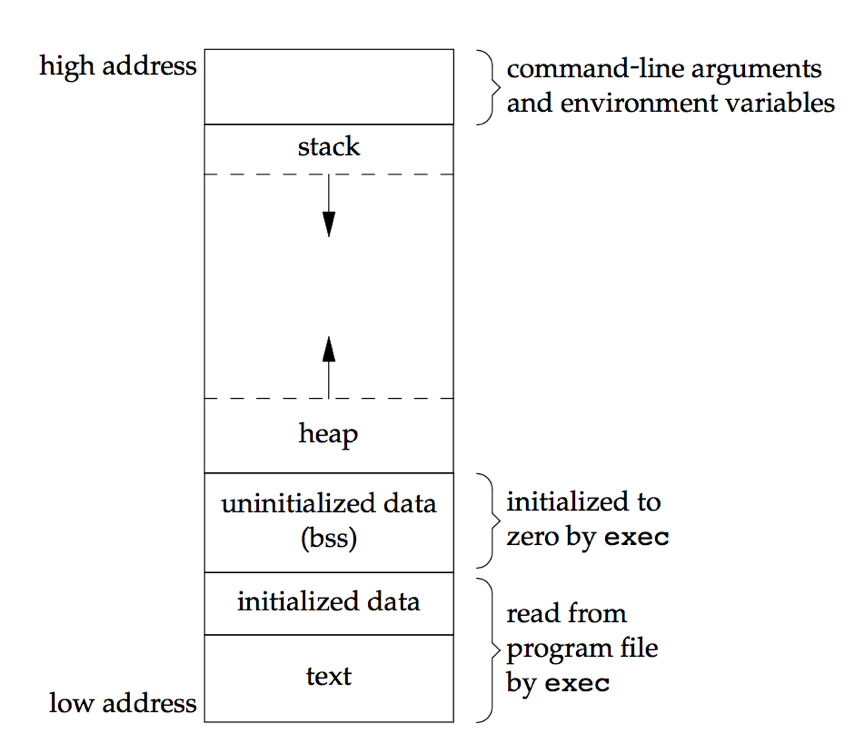

进程环境
===

main函数
---

`int main(int argc, char *argv[]);`
argc 是参数的个数，即第二个参数，字符串数组的个数。argv 是字符串数组，每个字符串视为给main函数的一个参数。

进程终止
---

8种结束进程的方式：

* 5种正常终止
1. `return` from main
2. calling `exit`
3. calling `_exit` or `_Exit`
4. `return` of the last thread from its starts routine
5. calling `pthread_exit` from the last thread

* 3种异常终止
6. calling `abort`
7. receipt of a signal
8. Response of the last thread to a cancellation request

#### exit函数

```c
#include <stdlib.h> 
void exit(int status); 
void _Exit(int status); 

#include <unistd.h> 
void _exit(int status);
```

`_exit`和`_Exit`直接返回到内核；`exit`先执行一些清理工作(包括执行标准I/0库的清理关闭工作，为所有打开的流执行fclose，将缓冲区的输出数据刷新到文件中。)，然后返回到内核。

三个exit函数均需要一个整形数做参数，这个值称为终止装填，在shell中通过命令`echo $?`可以查看上一条名利的终止状态。
如果：
a. 调用这些函数时没有带终止状态;
b. main函数执行return语句时未带参数；
c. main函数没有声明返回值类型为整型。
则终止状态的值为未定义。

#### atexit函数

```c
#include <stdlib.h>
int atexit(void (*func)(void));
		//	Returns: 0 if OK, nonzero on error
```

`atexit`用于注册终止回调程序，注册的程序将在`exit`执行期间自动回调。ISO C要求系统至少支持32个终止回调程序，
`exit`回调这些函数的顺序，与注册的顺序相反，被多次注册的函数，也会被多次回调。



[p7_2.c](p7_2.c)

命令行参数
---

[p7_3.c](p7_3.c)

环境表
---

环境表与参数表一样，也是一个字符指针数组，其中每个指针包含一个以null结束的c字符串地址。全局变量environ包含了该指针数组的地址。

按照惯例，环境变量字符串的形式为`name=value`

C程序存储空间布局
---

C程序由以下几部分组成:

* Text segment: 由CPU执行的机器指令部分。 通常，一个程序执行多次时，Text段可以共享。Text段只读。
* Initialized data segment: 通常称为数据段。包含了程序中需明确地赋初值的变量。
* Uninitialized data segment: 通常称为bss段。
* Stack: 存储函数调用栈信息
* Heap: 用于动态存储分配。



共享库
---

共享库使可执行文件中不再需要包含公共的库例程，而只需要在所有进程都可引用的存储区中维护其一个副本。

编译器选项 `-static`可以阻止使用动态库。

存储器分配
---

ISO C说明了三个用于存储空间动态分配的函数

* malloc 分配指定字节数的空间，初始值未定。
* calloc 分配执行字节数的空间，初始值为0。
* realloc 更改之前分配的存储空间。

```c
#include <stdlib.h>
void *malloc(size_t size);
void *calloc(size_t nobj, size_t size); 
void *realloc(void *ptr, size_t newsize);
		//	All three return: non-null pointer if OK, NULL on error
void free(void *ptr);
```

内存分配可能引起的问题：
1. 内存泄露，动态分配的内存在使用结束后，没有调用free函数去释放。对于监控进程或服务进程，大量进行这样的操作，最后会引起内存耗尽(Out of memory)的错误
2. 重复释放，动态分配的内存，多次调用free会引起异常。调用free之后，内存会被回收再次利用，其中数据结构很可能发生变化，如果仍以之前的方式对这片内存进行free，必然引起异常。
3. 悬垂指针，已经释放的指针，再次使用。已经释放的指针，经系统内存管理器回收利用，可能以用于存储其他数据，此时再以之前的方式读写数据，必然引起系统异常。

对于上述后两种问题，指针释放后，及时置为NULL，可使问题尽早暴露。

环境变量
---

```c
#include <stdlib.h>
char *getenv(const char *name);
		//	Returns: pointer to value associated with name, NULL if not found
```

此函数返回的指针为name=value中的value。通常建议使用getenv访问环境变量，而不是直接访问全局变量environ.

```c
#include <stdlib.h> 
int putenv(char *str);
		//	Returns: 0 if OK, nonzero on error
int setenv(const char *name, const char *value, int rewrite); 
int unsetenv(const char *name);
		//	Both return: 0 if OK, −1 on error
```

* putenv 取形式为name=value的字符串，将其放入环境变量列表。如果name已经存在，则覆盖其值。
* setenv 将name设置为value。如果name已经存在，若rewrite为非0值，则覆盖其值，若为0，则放弃修改。
* unsetenv 删除name的定义。即是不存在，也不出错。

setjmp 和 longjmp
---

函数间的goto

setjmp 用于设置目标点。
longjmp 用于跳至目标点。这种跳跃可跨函数。

```c
#include <setjmp.h>
int setjmp(jmp_buf env);
		//	Returns: 0 if called directly, nonzero if returning from a call to longjmp 
void longjmp(jmp_buf env, int val);
```

这组函数可以在跳转时，将函数的调用栈退回到setjmp调用的地方。
对于变量的处理是不确定的。对于自动变量和寄存器变量，多数系统实现是不回滚的；对于全局变量和静态变量，是不回滚的。
如果要避免longjmp对自动变量的回滚，可以将变量声明为volatile(易变的)

[p7_6.c](p7_6.c)

对于例子p7_6，编译时是否开启优化，会有不同的执行结果。
>$ gcc testjmp.c compile without any optimization
>$ ./a.out
>in f1():
>globval = 95, autoval = 96, regival = 97, volaval = 98, statval = 99 after longjmp:
>globval = 95, autoval = 96, regival = 97, volaval = 98, statval = 99 $ gcc -O testjmp.c compile with full optimization
>$ ./a.out
>in f1():
>globval = 95, autoval = 96, regival = 97, volaval = 98, statval = 99
>after longjmp:
>globval = 95, autoval = 2, regival = 3, volaval = 98, statval = 99


